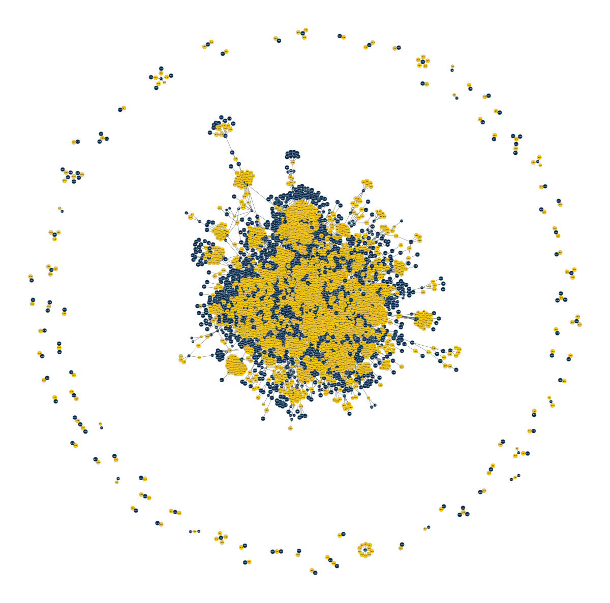

# Drug-disease networks and drug repurposing

This repo contains implementations of the models used for link prediction on the drug-disease network described in this [paper](https://www.biorxiv.org/content/10.1101/2025.01.31.634767v1).

## Usage
````
> git clone https://github.com/apolanco115/drug-dis-lp.git
````
For SBM and node2vec
````
> cd bipartiteLinkPrediction
> python main.py config.txt
````

The above expects a `test_edges.txt` file containing edges sampled for cross-validation. Each line represents an edge as a comma-separated pair of node indices. The file includes `num_trials` sets of randomly sampled edges, each of size equal to `test_size` × `total_edges`. For instance, if the graph has 100 edges, and `test_size=0.1`, `num_trials=10`, the file will contain 10 randomly sampled sets of 10 edges (100 lines total). Parameters for the models can be set in the `config.txt` file.

Similarly, one must also pass a `non_edges.txt` file containing pairs of unconnected nodes used as negative samples. For the figures in the paper, we used a `test_size=0.1` with `num_trials=50` and _all_ pairs of unconnected nodes as negative samples, so that the prevalence was ~10e-4.

For the remaining models, the code does the train/test split automatically. These files expect an edge list file as the first argument, this file is provided in the correct format in `dd-xall.hg`. We also provide the network data as a `.graphml` file in `bipartiteLinkPrediction/bipartite_link_prediction/data/ground_truth_networks/dmnet20240920.graphml`.

### TODO

- implement automatic train/test split 



